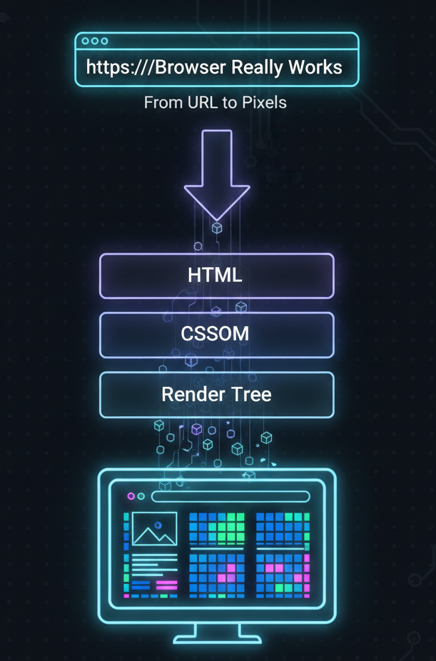

<div align="center">
<h1>How a Browser Works: A Beginner-Friendly Guide to Browser Internals</h1>
</div>

[Blog link](https://dev.to/6116hayat/how-a-browser-works-a-beginner-friendly-guide-to-browser-internals-p76)

---

## 🎙️ Introduction

You know the funny thing about marathons?

Once you survive a few, you start thinking you’re David Goggins.

I just wrapped up a full networking series — DNS, IPs, connections, the whole deal.

You can read it here: [Networking Blog Series Recap - DEV Community](https://dev.to/6116hayat/networking-blog-series-recap-205j)

But there was one elephant in the room.

We talked about **how browsers connect** to the internet —

never about **how browsers actually show things on your screen**.

That question bothered me.

So if it bothered you too… welcome. 😄

---

## 🧠 What a Browser Really Is

We talk a lot about IPs, DNS, and servers.

But what actually happens _inside_ the browser?

---

### 🧭 Browser ≠ Website Opener

(More than just a website opener)

> What is a browser?
> A browser acts as a **network client**, connecting users to servers and turning responses into visuals.

A browser is best thought of as a **network client**.

It:

- Connects users to servers
- Requests data over the network
- Translates raw responses into something humans can understand

So why isn’t a browser just a “website opener”?

- It actively participates in networking
- Multiple internal components work together
- It acts as a bridge between **client and server**
- It turns text and files into visuals and interactions

---

### ⌨️ Address bar → URL → request

Let’s zoom into the simplest flow:

Address bar → URL → Request → Response → Page

Step:

- You type a URL in the address bar
- The browser sends a request to a server
- The server responds with data (HTML, CSS, JS, images)
- The browser processes that data and shows you a page

Simple on the surface.

Wild underneath.

---

### 🏗️ Main parts of a browser (high-level overview)

No jargon overload. Just the essentials.


---

🌐 Network Layer:

- Handles all communication with servers
- Sends HTTP/HTTPS requests
- Receives HTML, CSS, JS, images
- Basically: the browser’s internet department

---

### ⚙️ Browser Engine

- The coordinator of everything
- Passes data between:
  - Networking layer
  - Rendering engine
  - JavaScript engine
- Decides _what happens next_

---

### 🎨 Rendering Engine

- The main worker behind what you see
- Parses HTML and CSS
- Builds the DOM
- Paints pixels on the screen

Without this, the web would just be text files.

---

### 🧩 JavaScript Engine

- Executes JavaScript code
- Enables interactivity and dynamic behavior
- Handles logic, events, and updates

This is why websites feel alive.

---

### 📦 Data Storage

- Stores cookies, cache, and local data
- Helps pages load faster
- Prevents repeating expensive network work

Yes, your browser remembers things. On purpose.

---

### 🖥️ User Interface (UI)

- Address bar, tabs, buttons, bookmarks
- Everything you directly interact with

The visible layer of a very invisible machine.

---

### ⚙️ Browser Engine and Rendering engine

They sound similar. They’re not.

| Aspect   | Browser Engine               | Rendering Engine      |
| -------- | ---------------------------- | --------------------- |
| Role     | Coordinates the browser      | Draws the page        |
| Focus    | Control, communication, flow | Visual output         |
| Handles  | Networking, UI, JS engine    | HTML, CSS, layout     |
| Examples | Blink, Gecko, WebKit         | WebCore, Gecko layout |
| Output   | Decisions                    | Pixels                |

Think of it like this:

- **Browser engine** = manager
- **Rendering engine** = artist

---

## 🌐 How Browser understands Web Page

(From internet files to structured meaning)

Ever wondered what happens _after_ the browser receives files?

How does code turn into structure?

---

### 📡 How HTML, CSS, and JS are fetched

Let’s keep this **super simple**.

The core flow:

- Browser fetches HTML, CSS, JS
- HTML is parsed → DOM
- CSS is parsed → CSSOM
- DOM + CSSOM → Render Tree
- Layout & paint → pixels on screen

That’s the browser lifecycle in five steps.

---

### 📄 Turning HTML into DOM


> DOM (Document Object Model)
> A tree-line structure representing HTML

Example:

```html
<html>
  <body>
    <h1>Hello</h1>
  </body>
</html>
```

Becomes a tree:

```powershell
html
 └── body
      └── h1 ("Hello")
```

The rendering engine builds this structure while parsing HTML.

Fun fact:
HTML parsing is forgiving.
Errors don’t crash the browser — they get handled gracefully.

---

### 🎨 Turning CSS into CSSOM


> **CSSOM (CSS Object Model)**:
> Another tree structure, but for styles.

- Example:
  ```css
  h1 {
    color: red;
    font-size: 20px;
  }
  ```
  Becomes rules like:
  ```powershell
  h1
   ├── color: red
   └── font-size: 20px
  ```

How it happens:

- Browser finds the `<link>` tag
- Fetches the CSS file
- Parses it into the CSSOM

Styles now have structure.

---

### 🧮 What parsing means (simple Example)

I’ve used the word _parsing_ a lot — time to demystify it.

**Parsing** means:

> Converting raw text into a structured format a computer can understand.

Just like how:

- A sentence has grammar
- A math expression has structure

Parsing turns chaos into meaning.

Not magic. Just rules.

---

## 🖥️ How a Page Is Drawn on the screen

(Turning structure into pixels)

This is where everything comes together.

---

### 🔗 How DOM and CSSOM work together

Think like a developer:

- HTML = skeleton
- CSS = makeup

Or more formally:

- DOM = structure
- CSSOM = style

> DOM + CSSOM = Render Tree

**Render Tree**:

You may I ask what is render tree

**Render Tree**:

- Contains only visible elements
- Knows what goes where
- Knows what color, size, and style

It updates whenever DOM or CSSOM changes.

---

### 📐 How layout decides size and position

First step of rendering.

Browser calculates:

- Element sizes
- Positions
- Spacing

This process is called **layout**.

When something changes (resize, DOM update):

- Layout recalculates
- This is called **reflow**

---

### 🖌️ How painting adds colors and text

Second step of rendering.

Now the browser:

- Applies colors
- Draws text
- Adds borders, shadows, images

Think of sketch → then coloring.

---

### 🟦 How everything finally shows up on screen

Final step.

- Layers are combined
- Pixels are pushed to the screen
- Page becomes visible

And this process can happen **many times per second**.

Browsers are fast. Like, scary fast.

---

## ☺️ Ending Thought

Browsers were ignored for a long time — treated as just tools.

But once you understand what’s happening underneath,

you realize they’re more like **operating systems for the web**.

One of my teachers once said:

I would like to quote my teacher here

> “Browsers are so powerful that plain HTML is enough to light up pixels on a screen.”

And honestly…

That _is_ kind of magical.

That’s it, folks —

see you in the next marathon 🏃‍♂️
