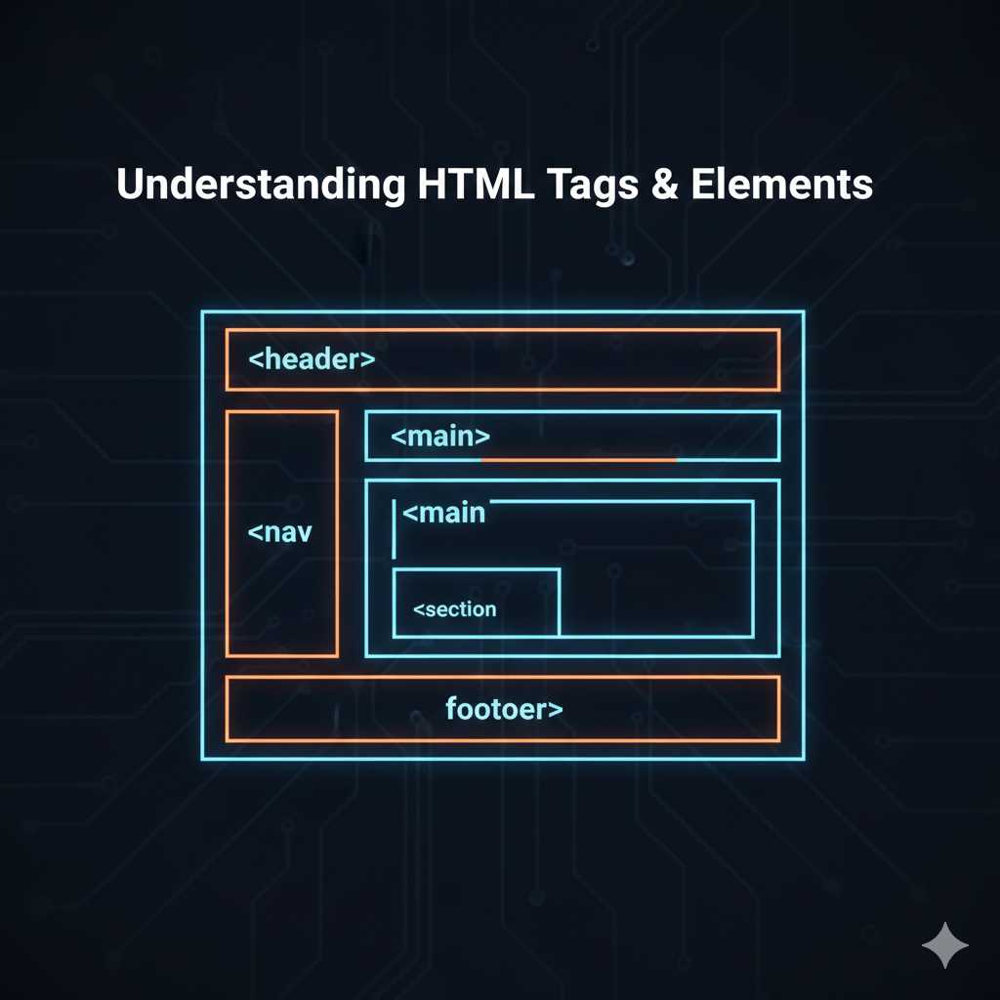

<div align="center">
<h1>Understanding HTML Tags and Elements</h1>
</div>

[Blog link](https://dev.to/6116hayat/understanding-html-tags-and-elements-3b07)

---

## **🌟 Introduction**

Hey Reader —

Lately, I’ve been tight on schedule and barely finding time to publish blogs.

But I’ve always believed something simple:

If you truly love doing something, you’ll find a way.

So here I am again — sharing another blog, this time about something people often underestimate… **HTML**.

Yes, HTML.

Most people rush past it. They want React, Node, AI, Web3 — all the shiny stuff. But here’s the truth:

If your HTML fundamentals are weak, everything built on top of it becomes shaky.

And here’s something even more serious — writing clean, semantic HTML can save companies thousands of dollars in accessibility-related legal issues. Poor structure isn’t just messy — it can become a compliance problem.

So today, let’s clear the fog.

---

## **🦴 HTML: The skeleton of web**

Let’s start simple.

> **What is HTML?**
>
> HTML (HyperText Markup Language) is not a programming language.
>
> It is a markup language used to structure content on the web.

Think of a webpage like a human body:

- 🦴 HTML → Skeleton (structure)
- 🎨 CSS → Appearance (style)
- 🧠 JavaScript → Behavior (logic)

Without HTML, there is nothing to style or interact with.

It defines:

- Headings
- Paragraphs
- Images
- Links
- Lists
- Sections

In short — it tells the browser what exists on the page.

### A Little History

HTML was created in 1991 by Tim Berners-Lee while working at CERN.

His goal wasn’t just formatting documents.

He wanted a universal way to structure information and make it accessible across computer systems worldwide.

It started as a tool for knowledge sharing.

And today, it powers the entire web.

---

## **🧱 HTML tags: the building blocks**

Now that we understand why HTML matters, let’s zoom into the real stars — **tags**.

The very first version of HTML included only 18 tags like:

`<title>` , `<p>`, `<h1> - <h6>`, `<ul>`, `<li>`.

Today, HTML has over 140 tags.

Relax.
You’ll regularly use maybe 20–30 of them.

Basic Structure of a Tag:

```html
<opening-tag> Content goes here <closing-tag></closing-tag></opening-tag>
```

Example:

```html
<p>Hello World</p>
```

Here’s what’s happening:

- `<p>` → Opening tag
- `Hello World` → Content
- `</p>` → Closing tag

---

## **🔍Tag vs Elements: spot the difference**

Just remember the simple definition about them:

> Tags : A tag is the instruction written inside angle brackets.

And…

> Elements: An element is the complete structure:

Let me give a demonstration through simple Image:


If you want to know more about the Tags - Elements.

Check out 👉 : [What is the difference between HTML tags and elements? - Stack Overflow](https://stackoverflow.com/questions/8937384/what-is-the-difference-between-html-tags-and-elements)

---

## 🏷️ Opening, Closing & Self-Closing Tags

Let me explain more about Tags (btw I love to over express myself, hehehe)

1. Opening & Closing Tags
   - Consider a duo tags. (one in start & other at the end)
   - Opening Tag: Starts an element. Written inside angle brackets. Example <p>
   - Closing Tag: Ends an element. Same as the opening tag but with a forward slash. Example </p>
   - Together, they wrap around content.


2. Self Closing Tags
   - Some tags don’t need a closing tag because they don’t wrap content.
   - Example: `` / `<br>` / `<hr>`


---

## 📚 Common HTML Tags You Should Know

Here are the essential ones every beginner must understand:

| Tag           | Usage                          |
| ------------- | ------------------------------ |
| `<h1>`–`<h6>` | Headings (largest to smallest) |
| `<p>`         | Paragraph                      |
| `<a>`         | Link                           |
| ``       | Image                          |
| `<br>`        | Line break                     |
| `<ul>`        | Unordered list                 |
| `<ol>`        | Ordered list                   |
| `<li>`        | List item                      |
| `<div>`       | Block container                |
| `<span>`      | Inline container               |

Master these first.

Everything else builds from here.

---

## **🎭 How elements behave**

So, I can see you really getting the hang of the tags.

No doubt that you got yourself an amazing writer 🙃

In the browser blog, we understood how the HTML parser works and parses HTML.

There are few HTML tags, where it forces the elements to behave differently on the screen. Let’s have a look at them.

1. Block Elements:
   - Block elements always starts with new line
   - It takes the full width of parent container
   - Used for larger structures like sections, paragraphs, or headings
   - Examples `<div>`, `<p>`, `<h1>`–`<h6>`, `<section>`
2. Inline Elements:
   - Inline elements do not start with new line
   - It takes as much width as the content
   - Used for styling or linking small parts of text.
   - Examples `<span>`, `<a>`, `<strong>`, `<em>`

### Quick Comparison

Block → Full-width structure

Inline → Small content inside structure

Understanding this saves you from layout confusion later.

---

## 🔎 Pro Tip: Inspect Real HTML

Here’s something powerful.

Right-click on any website → Click “Inspect”.

You’ll see the actual HTML behind it.

Browsers read HTML line by line and build a structure called the DOM (Document Object Model). That structure is what gets rendered on your screen.

The internet is basically one giant open classroom.

Use it.

---

## **💡 Ending thought**

That’s the foundation of HTML — simple, but powerful.

People often underestimate it because it looks easy.

But writing clean, semantic, well-structured HTML is a skill.

It improves:

- Accessibility
- SEO
- Performance
- Maintainability

And yes — it can prevent legal headaches too.

I’m still improving as a writer, just like you’re improving as a developer.

We build step by step.

Till then…

Stay curious.

Keep building.

And respect the skeleton before decorating the body.

PEACE OUT ✌️

---
