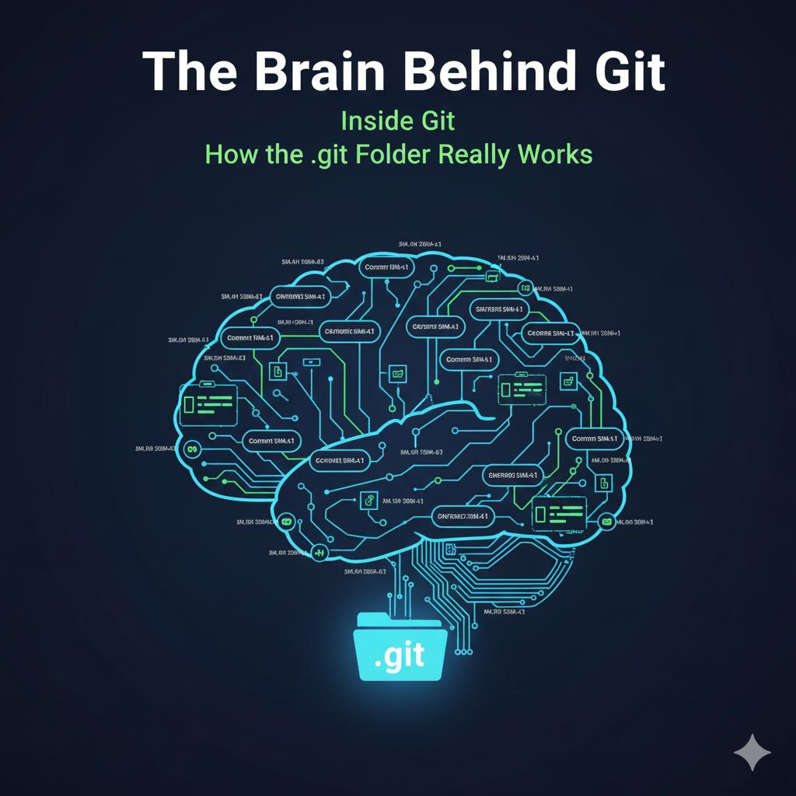

<h1 align="center">Inside Git: How It Works and the Role of the .git Folder</h1>

### 🎙️ Introduction

Hey Reader — I didn’t see you miles away in distance, but in experience.

You’ve been using Git commands for a while now. `git add`, `git commit`, maybe even `git push`. Things work… but the _why_ behind them feels blurry.

This blog is your backstage pass. We’ll step inside Git’s hidden brain, explore the mysterious `.git` folder, and uncover the objects and hashes that make Git one of the most reliable tools in software development. By the end, you won’t just **use** Git — you’ll **understand** it.

This is also the final post in my 3-part Git series. If you want the full journey:

[Blog 1: Why Version Control Exists: The Pendrive Problem](https://dev.to/6116hayat/why-version-control-exists-the-pendrive-problem-5aa3)

[Blog 2: Git for Beginners: Basics and Essential Commands](https://dev.to/6116hayat/git-for-beginners-basics-and-essential-commands-1omj)

---

### 🧠 The Hidden Brain of Git

In the last two blogs, we talked about _what_ Git is and _how_ we use it.

Now it’s time to understand **how Git thinks**.

Git isn’t just a tool — it’s a **snapshot machine**. Instead of storing changes line by line, Git captures the **entire state of your project** at a moment in time — like taking a photo of your codebase.

Why does this matter?

Because this design makes Git **fast and reliable**. Switching branches, rolling back, or merging isn’t about replaying edits — it’s about jumping between snapshots.

Once you see Git this way, its behavior starts making sense.

---

### 📁 Meet the `.git` Folder: Git’s Control Room

When you run `git init`, Git quietly creates a hidden `.git` folder. This folder isn’t optional — it **is** the repository.

Every Git project has this control room. It stores everything Git needs: commits, branches, tags, and configuration. Delete it, and your project instantly forgets its entire history.

Git hides this folder by default to protect it. But today, curiosity wins.

At a high level, the important parts are:

- `objects/` → where all actual data lives
- `refs/` → pointers to branches and tags
- `HEAD` → tells Git where you currently are

Understanding this folder means Git is no longer a black box — you’re looking at the wiring.

---

### 🤫 `.git` Folder contents:

We won’t explore every file, just the ones that matter most.

**`HEAD`**

- A plain text file pointing to the current branch
- Tells Git where new commits should be recorded
- Changing branches updates `HEAD`

**`refs/`**

- Stores references to commits (branches, tags, remotes)
- Organized into `heads/`, `tags/`, and `remotes/`
- Each ref points to a commit hash
- Acts like bookmarks in Git history

**`objects/`**

- Stores all Git data: blobs, trees, commits
- Objects are compressed and named by their SHA hash
- This is Git’s heart — everything else just points here
- Makes Git a **content-addressable filesystem**

Now let’s understand what those objects actually are.

---

### 🦖 Git’s Lego Blocks: Blob, Tree, Commit

Git stores everything using just three object types. Once you understand these, Git stops feeling complicated.

(Personally, I like calling them a soccer team — but LEGO works just as well.)

**Blob**

- Represents file contents only
- No filename, no directory info — just raw data
- Identified uniquely by its hash
- Lowest-level building block in Git

**Tree**

- Represents a directory (folder)
- Maps filenames to blobs or other trees
- Stores structure and permissions
- Allows Git to rebuild the project layout

**Commit**

- Represents a snapshot of the project
- Stores metadata (author, message, timestamp)
- Points to a single tree object
- References parent commits
- Commits link together to form Git history (a DAG)

Everything Git stores is built from these three pieces.

---

### ⚙️ What Really Happens When You `git add` & `git commit`

What you _think_ it does:

> “Moves files to staging.”

What actually happens:

- Git reads file contents from the working directory
- Creates blob objects for each file
- Stores them in `.git/objects` using hashes
- Updates the **index** (staging area) with filename → hash mappings
- Prepares the exact snapshot for the next commit

The staging area isn’t a list of files — it’s a **blueprint**.

### `git commit`

What you _think_ it does:

> “Saves changes.”

What actually happens:

- Git reads the index
- Builds tree objects to represent directories
- Creates a commit object with metadata
- Links it to its parent commit(s)
- Moves the branch pointer forward

That’s it. Clean. Deterministic. Reliable.

Let me demonstrate through a workflow diagram.

---

### 🤔 Why Git Never Forgets: Hashes & Trust

Git doesn’t trust filenames.

It trusts **math**.

Every object in Git is identified by a hash — a digital fingerprint of its content. Git originally used **SHA-1** and is now moving toward **SHA-256** for stronger integrity.

Same content? Same hash.

Change one byte — even a space — and Git produces a completely different hash.

This has powerful consequences:

- Duplicate files are stored only once
- History can’t be altered silently
- Corruption is instantly detectable

Git doesn’t ask _what changed_.

It asks _is this the same content?_

---

### 🧑‍💻 Ending Note:

Yes, this blog was a bit long — and Git is the reason why. Under the hood, Git is a carefully designed system built on snapshots, objects, and cryptographic trust.

But if you’ve made it this far, you now understand something most developers don’t:

Git isn’t just version control. It’s a system that **never forgets**, because everything is locked together by hashes.

So next time you type `git commit`, remember:

Git doesn’t trust filenames. It trusts math.

And that’s why Git works.

---
