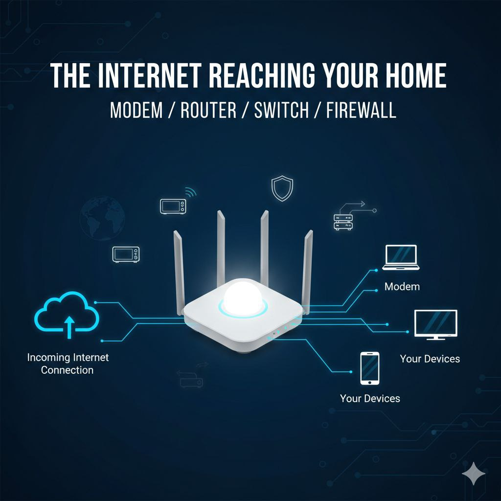

<div align="center">
<h1>Understanding Network Devices</h1>
<p>(What really happens when the internet reaches you)</p>
</div>

[Blog Link](https://dev.to/6116hayat/understanding-network-devices-3gg1)

## 🎙️ Introduction

Hey everyone — welcome back

This article started from pure curiosity. During one of our cohort session, we were deep diving into networking. Big words, simple terms. deceptively deep ideas. Credit to our teachers.

At some point, I stopped taking notes and stared at my Wi-Fi router for a minute or two.

That little box sits silently, yet every time our class lags, a video buffers or a game freezes, and those moments when your character gets shot because of **network issues** (yes gamers, sometimes it’s network… sometimes it’s skill issue). The little box becomes the prime suspect. We curse it. We reboot it.

But do we actually know what it does?

That curiosity led me down to a rabbit hole.

So before we go, let’s ask the real questions:

- What is internet really?
- How does it reach our homes?
- Which devices are responsible for carrying it?
- And how does data find your device and not you neighbor’s?

This article focuses on **what** and **how** of the internet — through the devices that quietly make it work.
I did the digging so you don’t have to.

This is also part of **series**. (If consistency doesn’t betray me)

---

## 🌐 Internet: The backbone of the Networking

> What is Internet?
>
> The internet is a global system of interconnected networks that communicates using standardized protocols

In simple terms, the internet not one giant thing — it’s a **collection of smaller networks** spread across the world, all agreeing to talk to each other.

That’s why someone sitting in one corner of the world can watch a Mr. Beast’s Video uploaded from another continent. Data moves from one network to another until it reaches you.

Think of it like this:

- Content is created inside a local network
- It moves through larger regional and global networks
- It finally reaches your local network

```
Cretator's Network → Global Network → Your Local Network
```


So when Mr. Beast uploads a video, it doesn’t magically appear on your phone. It moves through layers of networks — big and small until it lands inside your local network.

And this entire journey depends on **network devices**.

Let’s meet them.

---

## 📡Modems & Routers: The Dynamic Duo of Internet Access

(From connecting your home to directing the traffic.)

Most of us call everything “Wi-Fi”. But that box sitting in corner is doing **multiple jobs at once**.

Modern Wi-Fi devices usually combine a **modem** and a **router**.


---

### 🔌What is Modem?

> A modem connects your local network to your Internet Service Provider (ISP).

Modem = **Modulator + Demodulator**

Its core job is **translation**.

- Your ISP sends data using signals suited for long-distance transmission (electrical, optical, or radio)
- Your home network understands digital data
- The modem converts between the two

Earlier, this involved analog modulation (telephone lines). Modern fiber modems work differently, but the responsibility stays the same.

**make two very different systems communicate**.

Think of the modem as a **gateway** between your home and the wider network.

It doesn’t decide where data goes — it just makes sure communication is possible.

---

### 🚦What is Router?

> A router decides where the data should go

The router is the **decision maker**.

Every device in your home has an IP address. When data comes back from the internet, the router:

- Reads IP addresses
- Chooses the correct path
- Delivers data to the device that requested it

Otherwise, imagine searching hot cat pictures and having them open on your dad’s laptop. Absolute chaos

Router also handle **NAT (Network Address Translation)** happens — one public IP, many private devices. That’s why your laptop and phone can share the same internet connection without chaos.

Earlier, modems and routers were separate devices. Now they’re roommates inside one box.

Without a router, data would arrive — but have no idea where to land.

---

## 🔀 Switches vs Hubs: Who Really Runs Your Local Network?

(Smart forwarding vs noisy broadcasting explained.)

Now imagine you want a physical copy of that cat picture (for totally normal reasons), You send it from the laptop to printer. This happens inside your **local network**.

Inside your local network, devices also need to talk to each other.

That’s where switches (and historically, hubs) come in.

---

### 🔁 What is a Switch?

> A switch connects multiple devices within a LAN and forwards data intelligently

How?

- It learns MAC addresses
- Builds a forwarding table
- Sends data precisely where it’s needed

Fast. Efficient. Secure

---

### 📢 What is a Hub?

> A hub broadcasts data to all connected devices.

It receives data and broadcasts it to every connected device, whether they asked for it or not.

That’s how a secrets leak.

Hub creates:

- Noise
- Security issues
- Performance problems

That’s why hubs are mostly obsolete today.

**Quick comparison:**

- **Switch**: targeted delivery → faster, safer
- **Hub**: broadcast delivery → inefficient, outdated


---

## 🔒 Firewalls & Load Balancers: Guardians of Security and Scale

(Protecting your data while keeping systems smooth.)

Now things get serious.

---

### 🛡️ What is Firewall?

> A firewall monitors and controls network traffic based on security rules.

It acts as a barrier trusted and untrusted networks. It enforces rules.

Firewall decides:

- What gets in
- What stays out
- What needs inspection

Firewalls can be hardware or software, and they exist at many layers — from home routers to cloud infrastructure.

For developers, this is why:

- A service works locally but not in production
- An open port doesn’t mean public access

Yes, sometimes firewalls ruin your fun.

But they save you from far worse disasters.

---

### ⚖️ What is a Load Balancer?

> A load balancer distributes traffic across multiple servers

Without it:

- One server gets overwhelmed
- Everything slows down
- People start shouting

With it:

- Traffic is evenly spread
- Systems stay responsive
- Scaling becomes easier

If one server goes down, traffic is routed elsewhere — often without users noticing.

This is why modern backend systems scale without changing application logic.

So yes, the load balancer might just save you from getting yelled at when the internet slows down at home.

---

## 🌐 The Big Picture: How Network Devices Work Together

_(A real-world symphony of connectivity.)_

Let’s put it altogether.

**Goal**: You open YouTube and hit play.

1. Your device sends a request
2. The router decides where it should go
3. The modem translates signals for the ISP
4. The internet routes the request globally
5. Servers respond via a load balancer
6. Firewalls filter traffic
7. Switches deliver data locally
8. Your device receives the video

What feels instant is actually **a coordinated chain of decisions**.

Most real-world failures aren’t code bugs — they’re misunderstood network behavior.

---

## 🫰 Ending Thought

Networking isn’t just cables and blinking lights.

Each device has a clear role:

- Modem translates
- Router decides
- Switch delivers
- Firewall Protects
- Load balancer scales

So the next time your Wi-Fi lags, don’t just curse the router. Remember the quiet orchestra working behind the scenes — and maybe give that blinking box a nod of respect.


In the next blog ,we’ll go deeper into how the internet itself works and who its real worked are.

Until then —

**Stay curious. Stay connected.** 🚀

---
