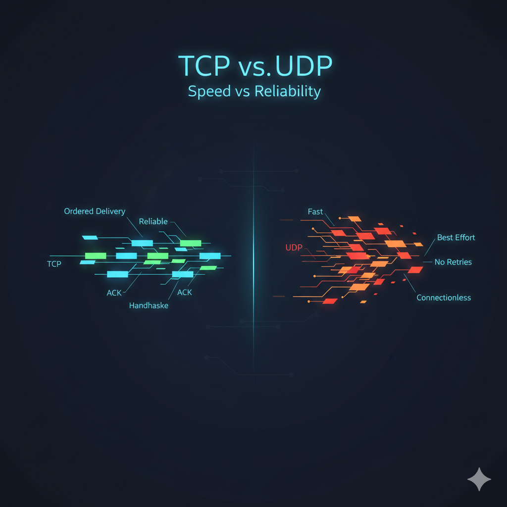

<h1>TCP vs UDP: When to Use What, and How TCP Relates to HTTP</h1>

[Blog link](https://dev.to/6116hayat/tcp-vs-udp-when-to-use-what-and-how-tcp-relates-to-http-1h6c)

---

## 🎙️ Introduction

Hey Reader — welcome back

The opening line already sounds like an NPC, never mind.

This networking series has been stretching my brain in the best way possible.

Every post peels back another layer of how the internet actually works — not the magical version we imagine, but the engineered one.

So far, we’ve talked about:

Blog 1: [Understanding Network Devices - DEV Community](https://dev.to/6116hayat/understanding-network-devices-3gg1)

Blog 2: [How DNS Resolution Works - DEV Community](https://dev.to/6116hayat/how-dns-resolution-works-24i9)

Blog 3: [DNS Record Types Explained - DEV Community](https://dev.to/6116hayat/dns-record-types-explained-38a0)

Now comes the next question:

Once the destination is known… how does data actually travel?

That’s where **TCP and UDP** come in — the rules of the internet.

---

## 🌐 TCP vs UDP — Two Ways Data Travels

Humans love rules.
Turns out, the internet does too.

Once computers started talking to each other at scale, rules became unavoidable.

Without rules, data would:

- Get lost
- Arrive out of order
- Or never arrive at all

TCP and UDP are the transport-layer rules that prevent that chaos.

---

### 📜 Why Internet Needs Rules?

The internet is like a busy highway.

Without traffic rules:

- Cars would crash
- Some would never reach their destination
- Others would arrive completely out of order

On the internet, those “cars” are **data packets**, and the rules they follow live in the **transport layer**.

---

### 🔎 What happens After DNS

When DNS finishes its job, a human-readable domain like `example.com` is resolved into an IP address like `93.184.216.34`

Once that’s done:

The destination is known

Now the real work begins: moving data

At this point, the transport layer decides:

Should this data arrive reliably and in order?

Or should it arrive as fast as possible, even if some is lost?

The answer determines whether **TCP or UDP** is used.

---

## 🚚 What are TCP and UDP?

The transport layer includes several protocols, but the internet mostly relies on two:

- **TCP — Transmission Control Protocol**
- **UDP — User Datagram Protocol**

They solve the same problem — moving data — but with very different priorities.

---

### ✅ TCP: Transmission Control Protocol

Before jumping into a definition, the name itself explains a lot.

**Transmission**

- Sending data from one system to another
- Data is split into smaller packets

**Control**

- TCP doesn’t send data blindly
- It controls the flow using:
  - Sequencing (ordering packets)
  - Error checking
  - Acknowledgements
  - Flow control

**Protocol**

- A shared set of rules that both sides understand

In short:

> **TCP** is a rulebook that ensures data is transmitted **reliably, in order, and correctly**, even if it means being slower.

---

### ⚡ UDP: User Datagram Protocol

UDP takes a very different approach.

**User**

- Refers to the application sending or receiving data
- The application decides how to handle loss

**Datagram**

- Each packet is independent
- No guarantee of order or delivery

**Protocol**

- A lightweight set of rules for fast communication

In short:

> UDP is a fast, connectionless protocol that sacrifices reliability for speed — ideal for real-time communication.

---

### 🔑 Key Differences

| Feature     | TCP                 | UDP                      |
| ----------- | ------------------- | ------------------------ |
| Connection  | Connection-oriented | Connectionless           |
| Reliability | Guaranteed delivery | Best-effort              |
| Ordering    | Maintained          | Not guaranteed           |
| Speed       | Slower              | Faster                   |
| Overhead    | Higher              | Minimal                  |
| Common Uses | Web, email, files   | Streaming, gaming, calls |

In short:

TCP ⇒ safe and reliable, but slower

UDP ⇒ fast and lightweight, but less reliable

---

## 🧭 When to use TCP vs UDP

The choice depends on one question:

What matters more — correctness or speed?

---

### 🖥️ When to Use TCP

Use TCP when **correctness matters more than speed**:

- 🌍 Web browsing (HTTP/HTTPS)
- 📂 File transfers (FTP, SFTP)
- 📧 Emails (SMTP, IMAP, POP3)
- 🖥️ Remote access (SSH)

If losing or reordering data breaks meaning, TCP is the right choice.

---

### 🎮 When to Use UDP

Use UDP when **speed matters more than perfection**:

- 🎥 Video streaming
- 🎮 Online gaming
- 📞 Voice and video calls
- 🌐 DNS lookups

In real-time systems, late data is often worse than missing data.

---

## 📑 What HTTP Fits

Here’s where beginners often get confused

**HTTP is not a transport protocol.**

- HTTP operates at the **application layer**
- It defines how clients and servers communicate
- It relies on transport protocols underneath

---

### 🧩 What HTTP Is (and Isn’t)

- ✅ A protocol for client–server communication
- ❌ Not responsible for packet delivery
- ❌ Not the same as TCP or UDP

HTTP defines:

- Request methods (GET, POST)
- Headers and status codes
- Request–response structure

---

## 🔗 How HTTP Relates to TCP

HTTP does not replace TCP — it **runs on top of it**.

The flow looks like this:

1. Browser creates an HTTP request
2. HTTP passes data to TCP
3. TCP ensures reliable delivery
4. IP routes packets across the network

In simple terms:

> HTTP defines what is said.
> TCP defines how it safely arrives.

This is why:

- HTTP ≠ TCP
- HTTP depends on a transport protocol
- Most HTTP traffic uses TCP
  _(HTTP/3 uses QUIC over UDP — a story for later)_

---

## 🤯 Ending Thought

The beauty of the internet lies in its layers.

Each protocol focuses on one responsibility:

- DNS finds _where_
- TCP and UDP decide _how_
- HTTP defines _what_

So the next time a webpage loads, a video streams, or a game responds instantly — remember:

> It’s not magic.
>
> It’s rules, layers, and very good engineering.

See you in the next blog. 🚀

---
