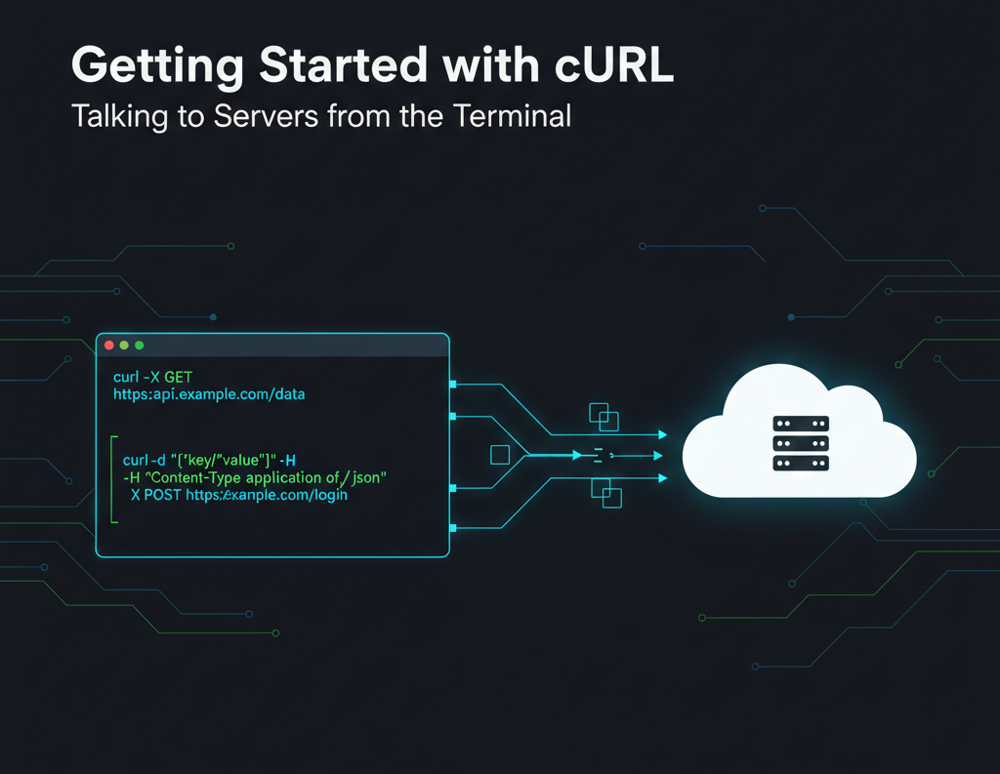

<div align="center">
<h1>Getting Started with cURL</h1>
</div>

[Blog link](https://dev.to/6116hayat/getting-started-with-curl-423k)

---

## 🎙️ Introduction

Hey reader — welcome back 👋

I tried to change the NPC line… but failed again 🙄

This is my **9th and final blog** in the Networking series, and honestly, it’s been a great learning experience for me too. The goal of this series was simple:

to understand the **gears and mechanisms behind something as simple as a search working**.

If you’ve been following along from the start — that’s amazing 🙌

If not, no worries. These blogs are always here to help you build a solid foundation in networking.

Blog 1: [Understanding Network Devices - DEV Community](https://dev.to/6116hayat/understanding-network-devices-3gg1)

Blog 2: [How DNS Resolution Works - DEV Community](https://dev.to/6116hayat/how-dns-resolution-works-24i9)

Blog 3: [DNS Record Types Explained - DEV Community](https://dev.to/6116hayat/dns-record-types-explained-2m7g)

Blog 4: [TCP vs UDP: When to Use What, and How TCP Relates to HTTP - DEV Community](https://dev.to/6116hayat/tcp-vs-udp-when-to-use-what-and-how-tcp-relates-to-http-1h6c)

Blog 5: [TCP 3-way Handshake - DEV Community](https://dev.to/6116hayat/tcp-vs-udp-when-to-use-what-and-how-tcp-relates-to-http-577)

For this final blog, I’ll introduce you to another tool — **just like `dig`** — that developers absolutely love: **cURL**.

---

## 💻 How we talk to Servers?

In the previous blogs, we learned how data travels from **LAN → WAN**, the devices involved, how domain names map to IP addresses, and how TCP and UDP work.

Now it’s time to focus on **how we actually talk to servers**.


---

### 🗄️ What Is a Server?

> A server is a computer that provides information or services to other computers.

In today’s world, every app or service you use — Instagram, Google, Netflix — runs on servers somewhere.

Your phone or laptop acts as a **client**, requesting data from these servers.

---

### 🧑 Client → Server → Response

For example:

- You open a website
- Your browser sends a request to a web server
- The server sends a response back
- Your browser displays it for you

That request–response cycle is the backbone of the internet.

---

## 🌐 Using cURL to Talk to a Server

Developers often need to communicate with servers **without a browser** — for testing, debugging, or understanding raw responses.

That’s where **cURL** comes in.

## 

### ⚙️ What Is cURL?

> cURL (Client URL) is a command-line tool that lets a client (your computer) communicate with a server using a URL to fetch or send data.

In simple terms:

- cURL runs in your terminal
- It sends requests to servers
- It shows you the raw responses

You can use it to:

- Fetch web pages
- Download files
- Test APIs

---

### 🔬 Your First cURL command

Let’s try a simple example.


What this means:

- `curl` → invokes the tool
- `I` → fetches only the response headers
- `http://www.google.com` → the target URL

This command:

- Sends a request to Google’s server
- Receives a response containing:
  - Status code (like `200 OK`)
  - Headers (metadata about the response)

The response will look something like this:


---

## 🎉 A Fun cURL Example

Try this command:

```powershell
curl [ascii.live/parrot](http://ascii.live/parrot)
```

Copy-paste it into your terminal…

and boom — you’ll see a **parrot dancing**🦜💃

To stop the madness, press **CTRL + C**.


More info here:

[GitHub – ascii-live](https://github.com/hugomd/ascii-live)

Yes, cURL can be fun too.

---

## 📃 cURL and API’s

Now let’s talk about APIs.

> An API (Application Programming Interface) is a server designed to communicate with programs instead of people.

## 

### 🔑 Basic API Requests with cURL

### GET — Receive Data

```bash
curl https://api.example.com/users
```

This fetches a list of users from the API.

---

### POST — Send Data

```bash
curl -X POST https://api.example.com/users \
-H"Content-Type: application/json" \
-d'{"name":"Alice","age":25}'

```

This sends new user data to the API.

---

### 📌 Why Developers Use cURL for APIs

- Quickly test endpoints
- No need to write application code
- Easily inspect status codes, headers, and responses
- Great for debugging backend issues

---

## 😗 Ending Thought

This blog series has been **one heck of a journey**.

We covered the fundamentals that give you a real understanding of how the internet works behind the scenes.

If you’ve been reading consistently — thank you.

If not, give it a try. It will genuinely change how you look at the web.

Till then —

**See ya, Amigos 🦩**
